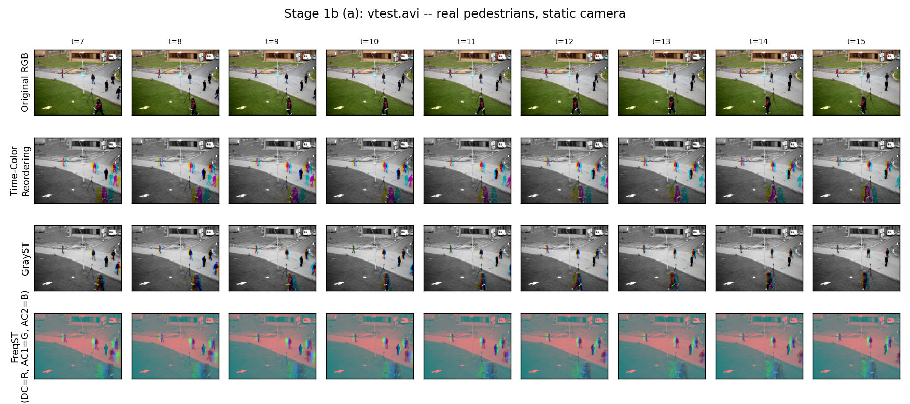
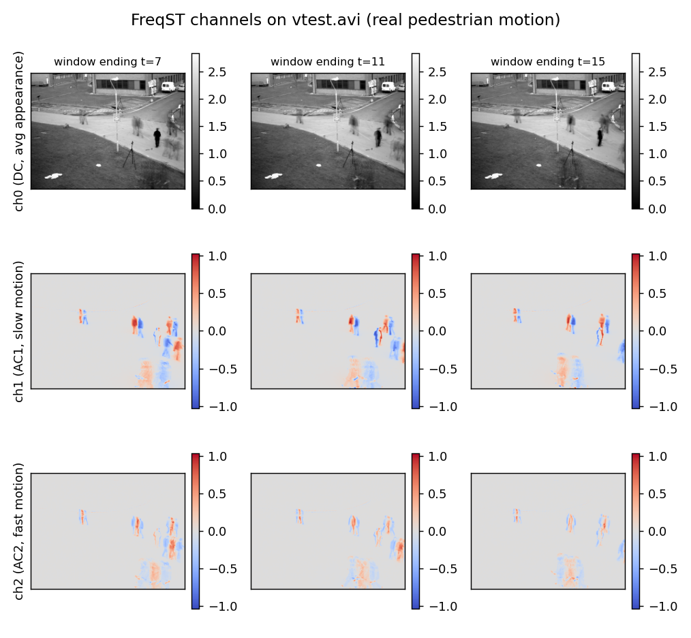
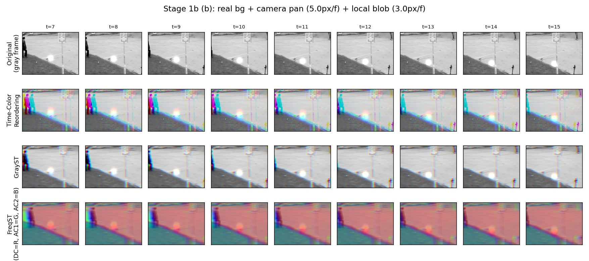
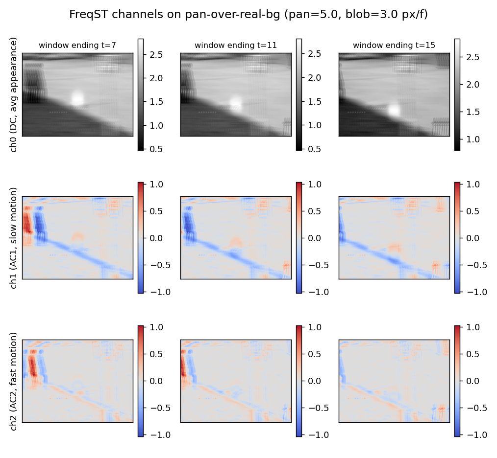

# Stage 1b — real-video qualitative check

Script: [`experiments/stage1b.py`](../experiments/stage1b.py) · Results: [`results/stage1b/`](../results/stage1b/) · No training. Back to [CLAUDE.md](../CLAUDE.md).

## What it does

Checks whether Stage 1's clean synthetic behavior survives real pixels, in the paper's
Figure-3 layout (rows = method, cols = frames across time): Original, Time-Color
Reordering, GrayST, FreqST (DC=R, AC1=G, AC2=B).

Two clips, both windowed with W=8, stride=1:

- **(a) `data/vtest.avi`** — OpenCV's own sample clip (Apache-2.0, freely
  redistributable), real pedestrians on a static security-camera shot. Most-active
  9-frame stretch auto-selected by max frame-to-frame difference (starts at frame 511).
- **(b) pan-over-real-background** (`generate_pan_over_real_background` in
  [`synthetic_data.py`](../synthetic_data.py)) — a single static frame from `vtest.avi`
  used as a large real-texture background; a 240×180 viewport pans across it at
  **5.0 px/frame** (simulated camera motion), with a synthetic Gaussian blob composited
  on top moving locally at **3.0 px/frame** (simulated object motion). Exact ground
  truth for both motions, so the two can be told apart quantitatively.

Two quantitative metrics computed from the FreqST/TC AC channels:

- **`ac_spatial_spread`** — fraction of pixels needed to hold 80% of AC energy
  (concentration: small = compact moving region, large = smeared across the frame).
- **`blob_energy_fraction`** — fraction of AC energy landing on the known blob location
  vs. elsewhere (pan clip only, uses ground truth).

## Key finding

**On the static-camera clip, FreqST works exactly as designed:** DC is a genuinely
clean averaged frame (background sharp, walkers ghosted along their paths); AC lights
up only on the moving pedestrians (80% of AC energy in ~4% of pixels, same as TC
Reordering).

**Under the pan, the clean separation does NOT survive.** DC degrades into a
directional motion-blur smear (every pixel sees different background texture over the
window). AC fires along every background edge the pan drags across — the local blob is
faint by comparison. Quantitatively: spread jumps from ~4% to ~12% of pixels for BOTH
FreqST and TC Reordering; fraction of motion energy actually landing on the blob is
only **~5% for both** (FreqST 0.053 vs TC 0.048) — FreqST is not "saved" by its
frequency split here. TC Reordering shows the same failure mode.

**Why:** FreqST's DC/AC split removes the temporally-constant part per pixel. That only
isolates motion cleanly when the background is temporally constant per pixel — i.e. a
static camera. A pan violates exactly that assumption.

## Output files

**Static-camera clip (`vtest.avi`):**

**Pan-over-real-background clip:**

- `metrics.txt` — spread + blob-energy-fraction numbers

## Why it matters

This is the finding that motivated [Stage 3](stage3.md): if FreqST doesn't cleanly
separate local/global motion at the pixel level, does that failure actually hurt
downstream classification? (Answer, from Stage 3: surprisingly, no.) Also the source of
the pan-over-real-bg generator reused conceptually (synthetic version) in Stage 3's
Dataset B.
