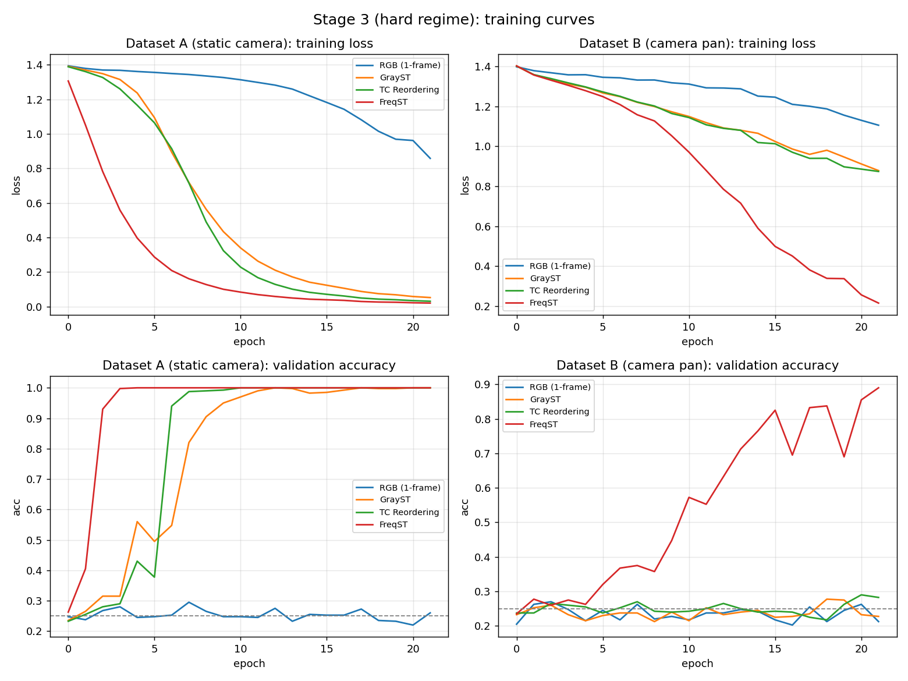
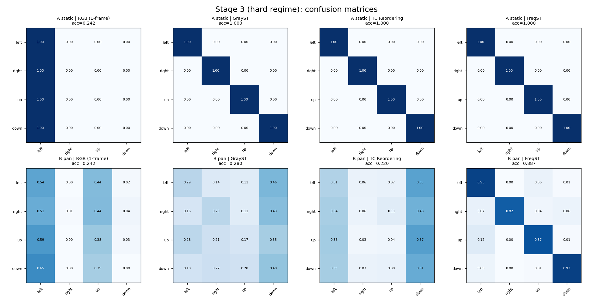
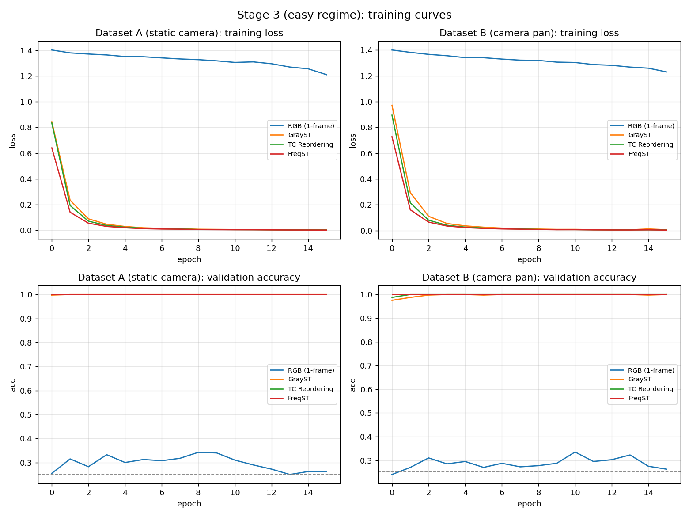
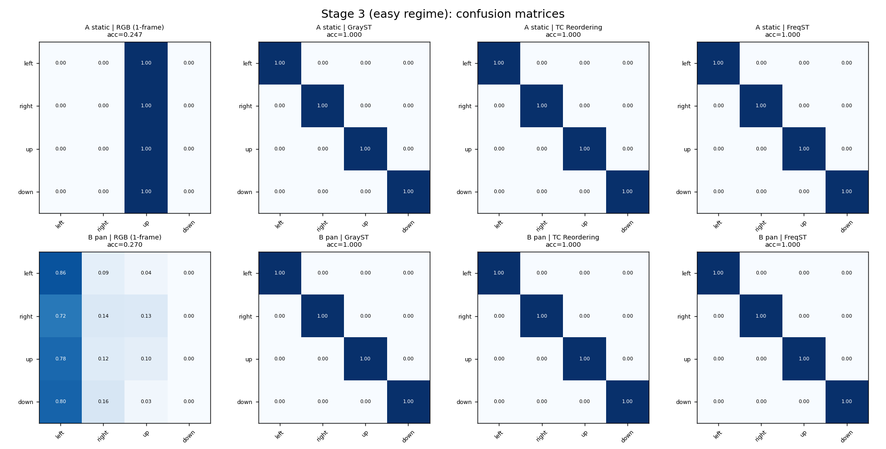

# Stage 3 — learnability check

Script: [`experiments/stage3.py`](../experiments/stage3.py) · Results: [`results/stage3/`](../results/stage3/) · Trains. Back to [CLAUDE.md](../CLAUDE.md).

## What it does

[Stage 1b](stage1b.md) showed FreqST doesn't cleanly separate local/global motion at
the pixel level under camera pan. Stage 3 asks: does that failure actually matter for
*classification*?

- **Task:** 4-class blob motion-direction (left/right/up/down).
- **Model:** one `TinyCNN` ([`models.py`](../models.py)) — identical architecture and
  hyperparameters across every run; only the input preprocessing changes.
- **Methods (all → 3-channel input):** `rgb` (single trajectory-center frame,
  replicated — appearance-only control, expected ~chance since that frame's blob
  position is direction-independent), `grayst`, `tc_reordering`, `freqst`.
- **Datasets**, via `generate_labeled_clip` in
  [`synthetic_data.py`](../synthetic_data.py):
  - **A** = static camera.
  - **B** = same task + a random global background pan, speed comparable-to-exceeding
    the blob's — a pure nuisance carrying no label information (the Stage 1b
    camera-motion confound, now inside a training loop).
  - Blob speed `U(1,3)` px/frame, chosen to sit mostly below Stage 1's ~4 px/frame
    energy-leakage breakpoint, so FreqST's 3 kept coefficients hold most of the motion
    energy.
- **Two difficulty regimes** (`REGIMES` dict — only these params differ):
  - `easy` — bright blob, low noise, bigger model/data.
  - `hard` — dim (sigma=2) blob, more noise, smaller model, less data, faster pan
    `U(3,6)`.
- Also runs a FreqST window-size sweep (W=4/8/12) on Dataset A only.

## Key finding

**Easy regime saturates** — all three temporal methods hit 1.000 on both datasets; RGB
stays at chance. Can't rank methods, but does show: when the task is easy, the pan
costs *zero* accuracy for anyone — the CNN just reads the compact blob and ignores the
diffuse pan.

**Hard regime forces the methods apart** (`results/stage3/hard/`):

| method | A: static | B: + pan | drop |
|---|---|---|---|
| RGB (1-frame) | 0.26 | 0.22 | ~0 (chance) |
| GrayST | 0.99 | **0.32** | 0.68 |
| TC Reordering | 1.00 | **0.31** | 0.69 |
| **FreqST** | 1.00 | **0.90** | 0.10 |

Static camera: FreqST matches GrayST/TC — all essentially perfect. Under pan: GrayST
and TC **collapse to near chance** while FreqST holds at 0.90. This is the headline
result of the whole prototype — it partially reverses the Stage 1b worry: pixel-level
corruption under pan is real, but doesn't translate into a classification penalty for
FreqST.

Window-size sweep (Dataset A): W=4/8/12 all gave 1.000 — window choice didn't matter
here because blob speeds were kept in the resolvable range from Stage 1.

## Output files

**Hard regime — training curves and confusion matrices (the headline result):**

**Easy regime — saturates, included for completeness:**

- `metrics.txt` — accuracy table for both regimes + window sweep

## Fairness caveat

FreqST integrates 8 frames into 3 channels; GrayST/TC use only 3 raw frames. Part of
the advantage is simply "more temporal context" — but that's precisely FreqST's design
claim (compress a W-frame window at no extra cost to the backbone). Whether this is a
fair advantage or a confound is directly tested in [Stage 3-verify](stage3_verify.md)
and [Stage 4](stage4_window9.md).

## Why it matters

This single result is why the project is worth continuing past the synthetic prototype
— see [Stage 3-verify](stage3_verify.md), [Stage 4](stage4_window9.md), and
[Stage 4b](stage4b_grayst_ensemble.md) for the controls that stress-test whether it's
real.
