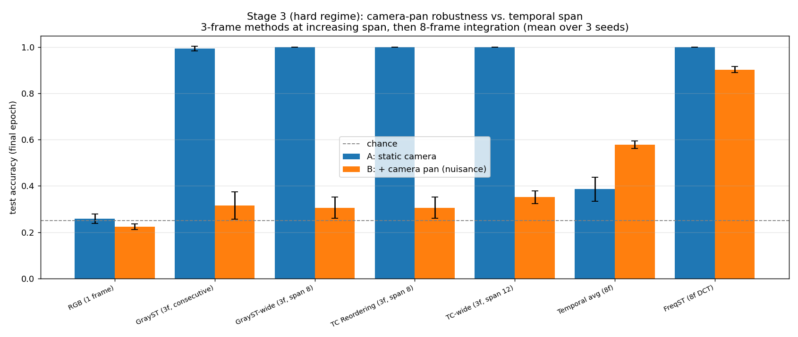

# Stage 3-verify — robustness controls

Script: [`experiments/stage3_verify.py`](../experiments/stage3_verify.py) · Results: [`results/stage3/verify_*`](../results/stage3/) · Trains, 3 seeds, hard regime only. Back to [CLAUDE.md](../CLAUDE.md).

## What it does

[Stage 3](stage3.md)'s headline result (FreqST 0.90 vs GrayST/TC ~0.31 under pan) is
the whole project's case for continuing — so before trusting it, this script attacks it
from three angles, all in the hard regime:

1. **Seed stability.** Reruns every method across 3 seeds (`[10, 20, 30]`).
2. **Is it just "more frames" or "wider time span," not frequency structure?** Adds
   controls, all still 3-channel outputs:
   - `tavg` — plain 8-frame average, replicated to 3 channels. Isolates "integrate the
     whole window" from "frequency-decompose the whole window" (FreqST's DC channel
     alone, roughly).
   - `grayst_wide` — 3 frames spread across the 8-frame window (`[0, W/2, W-1]`)
     instead of 3 consecutive. Same frame/channel count as GrayST, wider span.
   - `tc_wide` — 3 frames spread across the *full* 12-frame clip (`[0, L/2, L-1]`) —
     the widest possible span, wider than FreqST's own 8-frame window.
3. **Epoch-selection honesty.** Every reported number elsewhere is the *final-epoch*
   model's test accuracy (no best-epoch selection, no early stopping). This script also
   tracks best-over-epochs test accuracy per seed, to check the final number isn't
   sitting in a lucky dip of a noisy curve.

## Key finding

**Check 1 (span):** widening span does essentially nothing — GrayST-wide (span 8) and
TC-wide (span 12) still collapse under pan (0.31, 0.35), barely different from GrayST's
own 0.32. The big jumps come from *integrating the whole window* (tavg: 0.58) and then
*frequency decomposition on top* (FreqST: 0.90) — not from how far apart 3 samples sit.
Confound ruled out: it's integration + frequency structure, not time span.

**Check 2 (epoch selection):** FreqST's headline is not inflated — final trails best by
at most 0.023 (mean 0.903 final vs 0.914 best across seeds). If anything the reported
number is mildly conservative.

FreqST's pan accuracy: **0.903 ± 0.013** across seeds — stable.

## Output files

**Bar chart, all methods + controls, both datasets, mean ± range over 3 seeds:**

- `results/stage3/verify_metrics.txt` — full table (A static / B pan final / B pan
  best / drop), per-method, mean ± half-range over seeds; plus per-seed FreqST
  final-vs-best breakdown.

## Why it matters

This is the piece that turns Stage 3's single-run number into a defensible result.
Combined with [Stage 4](stage4_window9.md) and
[Stage 4b](stage4b_grayst_ensemble.md) (same-window and best-effort-GrayST controls),
this closes out the "is FreqST's pan-robustness real, or an artifact of unfair frame
budgets / lucky training?" question — see [CLAUDE.md](../CLAUDE.md) for the combined
verdict.
