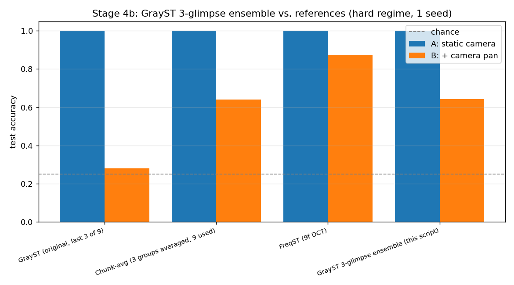

# Stage 4b — GrayST as a 3-glimpse ensemble

Script: [`experiments/stage4b_grayst_ensemble.py`](../experiments/stage4b_grayst_ensemble.py) · Results: [`results/stage4b_grayst_ensemble/`](../results/stage4b_grayst_ensemble/) · Trains, hard regime, single seed. **Not in `run_all.sh` — run manually.** Back to [CLAUDE.md](../CLAUDE.md).

## What it does

[Stage 4](stage4_window9.md) showed GrayST discards 6 of 9 available frames by
construction. This script gives GrayST its fairest possible shot: no concatenation, no
pixel-averaging, no discarding.

Splits the 9-frame window into 3 non-overlapping GrayST triplets:
`(0,1,2)`, `(3,4,5)`, `(6,7,8)` — each glimpse is a genuine, unmodified GrayST image (3
raw frames stacked as channels, same op as `transforms.grayst()`, just on a different
slice).

- **Training:** every clip contributes 3 training examples (one per glimpse), all
  carrying the clip's single ground-truth label — 3x the effective training set size.
- **Test:** the 3 glimpses of a test clip are each scored by the one shared CNN, their
  softmax outputs averaged, and the argmax of that average is the single final
  prediction — directly comparable to every other method's one-prediction-per-clip
  accuracy.

Same underlying clips as [Stage 3](stage3.md)/[Stage 4](stage4_window9.md) (identical
seeds), hard regime, single seed.

## Key finding

`results/stage4b_grayst_ensemble/metrics.txt`:

| method | A (static) | B (pan) |
|---|---|---|
| GrayST (original, last 3 of 9) | 1.000 | 0.280 |
| Chunk-avg (3 groups averaged, 9 used) | 1.000 | 0.640 |
| **GrayST 3-glimpse ensemble (this script)** | 1.000 | **0.642** |
| **FreqST (9f DCT)** | 1.000 | **0.875** |

Even GrayST's best-effort version — training-time augmentation, all 9 frames used,
test-time ensembling — only reaches 0.642 on the pan dataset. Landing almost exactly on
chunk-avg's 0.640 (a coincidence worth noting, not a design target) and still well
short of FreqST's 0.875–0.90. This is the strongest of the fairness controls: it rules
out "frame count" and "ensembling" as the explanation for FreqST's advantage — what's
left standing is the frequency decomposition itself.

## Output files

- `metrics.txt` — full table above

## Why it matters

Closes out the "is it really the DCT?" question raised by [Stage 3](stage3.md)'s
fairness caveat. Combined with [Stage 3-verify](stage3_verify.md)'s span controls and
[Stage 4](stage4_window9.md)'s same-window check, this is the full set of controls
behind the project's current headline claim — see [CLAUDE.md](../CLAUDE.md) for the
combined verdict and what's still untested (real data).
